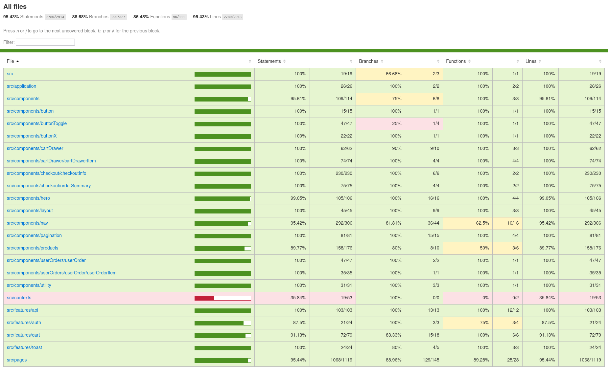

# Shopping WebApp by Manvinderjit

### New Design

The new version of the website is now deployed.

`Live Link`: [Shopping App](https://2023-top-project-shopping-cart.pages.dev/)

## 1. Description
A Vite-React Redux Webapp e-commerce portal allows customers to purchase products. It has been updated to use `TypeScript`, `JavaScript`, `Tailwind CSS`, `React Redux`, `React Router Dom`, and `JWT` technologies. For testing it uses `React Testing Library` and `ViTest` along with `msw` for mocking.

Is a part of a two-app ecosystem for an organization selling computer hardware. Leverages RESTful APIs provided by the [Inventory Management App - Live Link](https://ia.manvinderjit.com/), which is the other app in the ecosystem. [Click here for Inventory App's GitHub Page](https://github.com/manvinderjit/2023-TOP-Project-Inventory-Application). 

Shopping App is an e-commerce store that supports the following functions:

1. `E-commerce Store`: It allows customers to purchase items.
2. `Register and Login`: Customers can register and log-in to place orders.
3. `Cart Functionality`: Customers can add items to cart and checkout.
4. `Order History`: Customers can view their order history.
5. `Manage Orders`: Customers can manage their orders and cancel them as required.
6. `Subscription`: Customers can manage subscription to promotional offers from the Dashboard.

## 2. App Ecosystem

The app ecosystem consists of two user roles:
- `Customers:` They use this [Shopping App](https://2023-top-project-shopping-cart.pages.dev/) to place orders.
- `Employees`: They use the [Inventory App](https://ia.manvinderjit.com) to perform inventory and logistics operations, including processing orders received through this `Shopping App`. Promos and products displayed on the `Shopping App` are also managed through the CMS provided by the `Inventory App`.

The following diagram provides an architectural view of the ecosystem. This Shopping App is only the React Single Page Application. The RESTful APIs and backend services are provided by the Inventory App. Visit the [Inventory App's GitHub Page](https://github.com/manvinderjit/2023-TOP-Project-Inventory-Application) for more information on the backend.

## 3.Tech Stack

### Core Development Stack
The `Shopping App` makes use of the following technologies and packages:
- `React Vite`: React is used for the front-end with Vite build tool.
- `React Redux`: React Redux is used for state management.
- `Tailwind CSS`: Tailwind CSS is now used for CSS styling. Formerly it used React Bootstrap.
- `Redux RTK Queries`: RESTful API calls are made through Redux RTK queries and mutations. Previously HTML fetch was used.
- `JWT Tokens`: Authentication is established through JWT tokens stored in Redux state.

### Deployment Stack
The `Shopping App` is deployed using following technologies:
- `CI/CD Pipeline With GitHub`: A CI/CD pipeline is created to automatically deploy newly implemented features to the production environment.
- `Cloud Flare Pages`: The application is deployed via Cloud Flare pages that automatically builds and deploys when changes are pushed to the `prodtest` branch (will change to `production` branch once the project is complete).

# 4. Objectives

## 4.1 Skill Demonstration Objectives
The Shopping Cart is created to demonstrate the following coding abilities:

    1. Build a React app utilizing RESTful APIs.

    2. Demonstrate use of React-Redux for global state management.

    3. Exhibit capability to work with JWT tokens for authentication.

    4. Demonstrate familiarity with and use of Tailwind CSS and React Router Dom packages.

    5. Demonstrate TDD (Test-Driven Development) by using React Testing Library and ViTest.

    6. Utilizing a CI/CD pipeline for integration and deployment of new features automatically.
    
    
## 4.2 Functional Objectives
The Shopping Cart webapp has the following functional objectives:

    1. Allows customers to purchase computer hardware from a retailer and manage their orders.

    2. Allows the retailer to list various products and promos on the Shopping Cart app by using the Inventory App's CMS functionality.

Inventory App GitHub Repo [Click Here for Inventory App GitHub Repo Page](https://github.com/manvinderjit/2023-TOP-Project-Inventory-Application).

Inventory App Live Link [Click Here for Inventory App Live Link](https://ia.manvinderjit.com/).

# 5. Test Coverage

### Live Test Coverage Report:
[Click here for Live Coverage report through html-preview.github.io](https://html-preview.github.io/?url=https://raw.githubusercontent.com/manvinderjit/2023-TOP-Project-Shopping-Cart/main/coverage/index.html)

### Current Test Coverage Report(main branch):
The following is the current test coverage report screenshot for the main branch.

